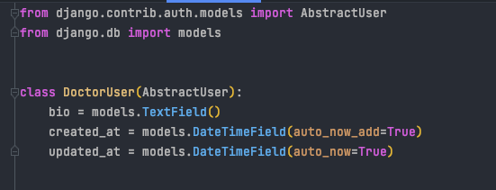
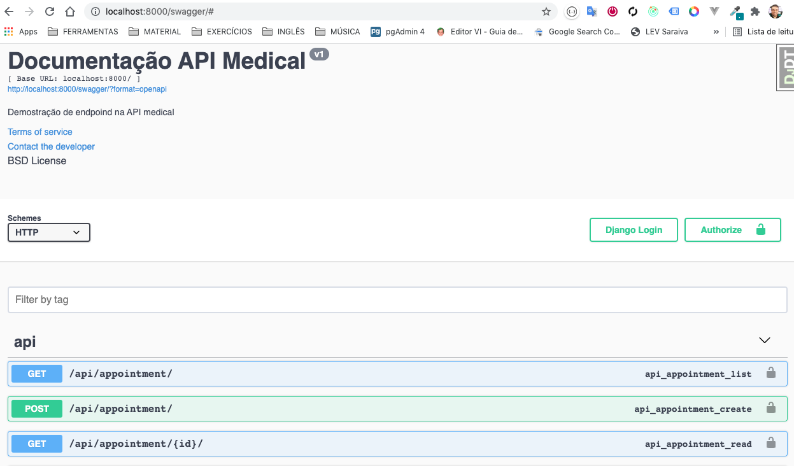
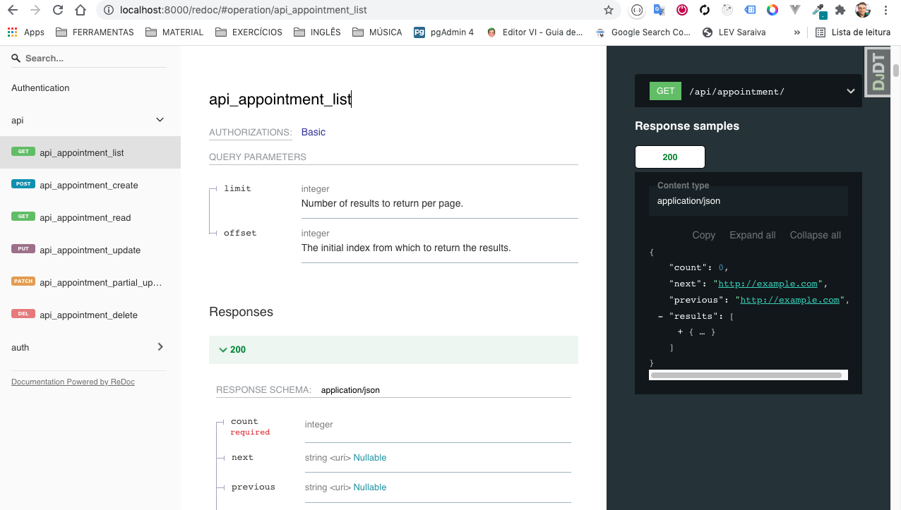
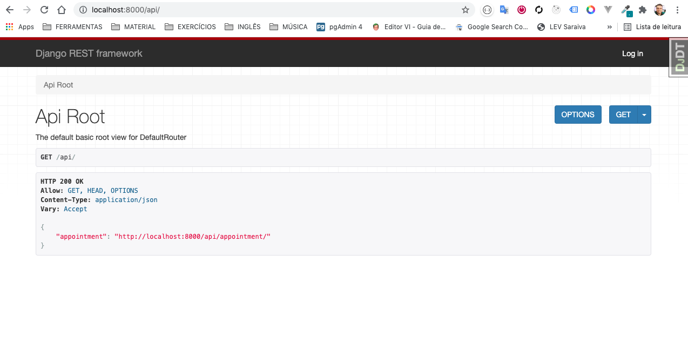
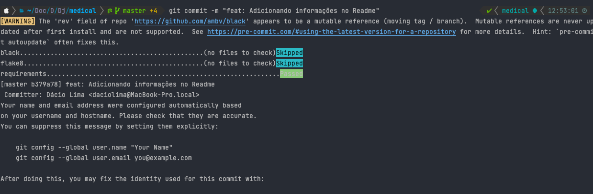
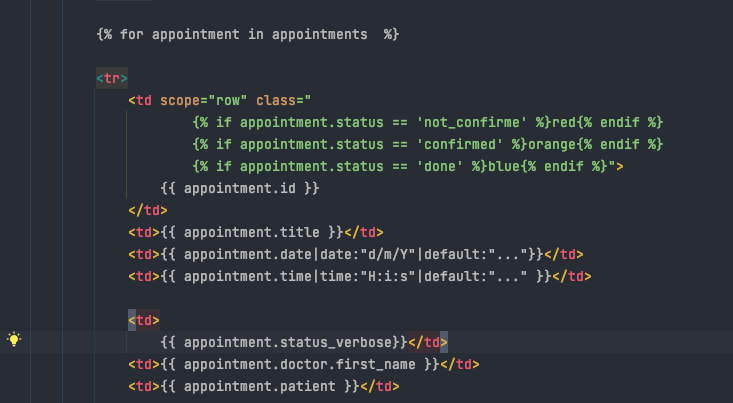
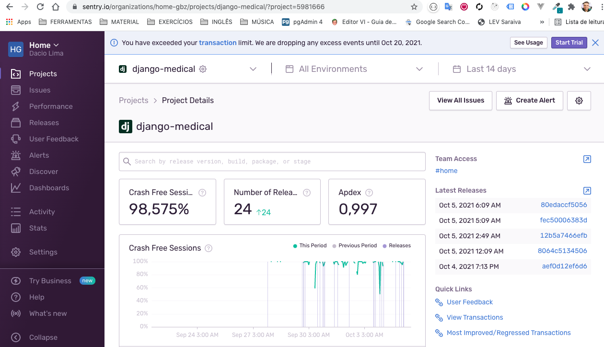
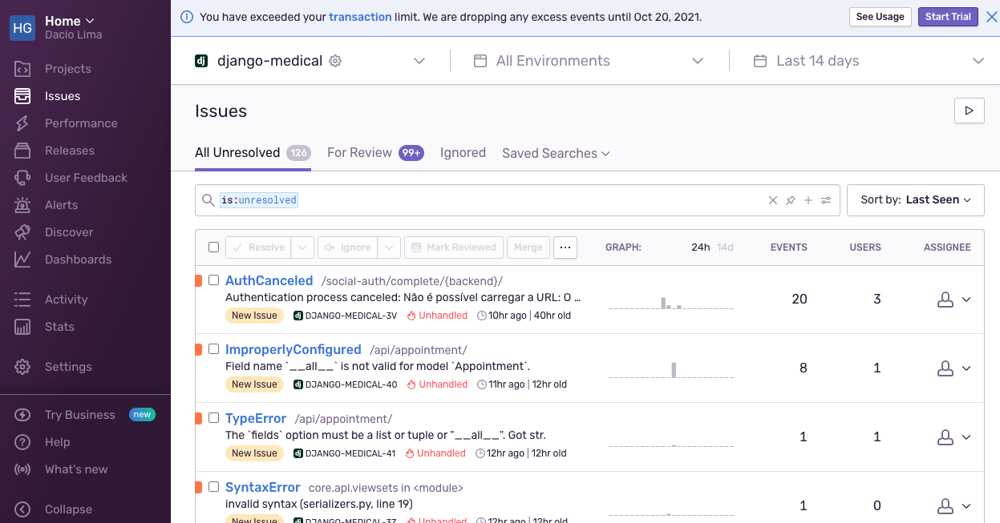
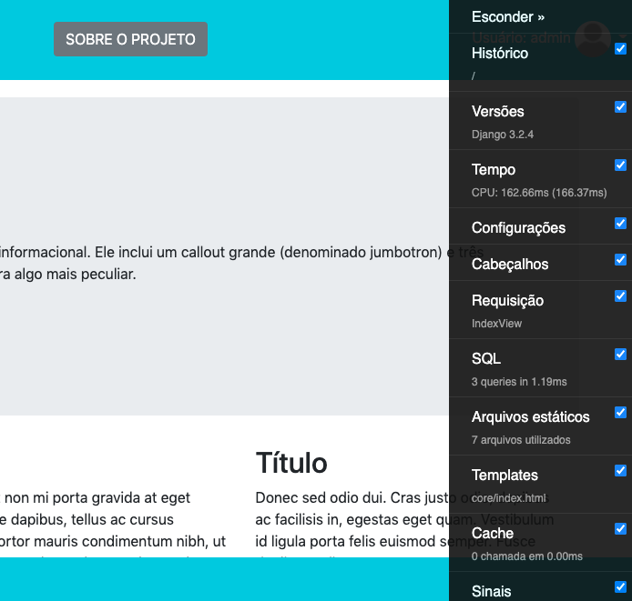

# Projeto Desafio Django - Medical

- Projeto Django simulando agendamento consulta de pacientes.
- Autenticação pode ser feita usando rede social Facebook e Google.
- Aplicação: *http://medical-desafio.herokuapp.com*
- Login teste: 
  - Usuário: **usuario**
  - Password: **user1234**

OBS: 
- Foi realizado criação de um Custom Model afim de caso seja preciso adicionar ou alterar algum campo
no user não tenhamos problemas para isso, coisa que acontece quando usa-se o model padrão de user do django.
  Na ocasião foi adicionado os campos bio, created_at e update_at. 

Code Model



### Libs Base
Usei nesse projeto de desafio as tecnologias abaixo.
Além do que foi pedido, criei também usando o DRF um endpoint : /api disponibilizando as consultas.
Também implementei a lib drf_yasg para rodar o o swagger/OpenAPI e redoc para documentação dos endpoints 
disponíveis. endepoints: /swagger e /redoc`**~~~~**` 
Disponibilizado também através da lib djoser os endpoints para autenticação via jwt.
```shell 
- python 3.9.7
- Django 3.2.4
- Restframework 3.12.4
- djoser==2.1.0
- djangorestframework-simplejwt==4.8.0
- django_extensions
- drf_yasg = Documentação OpenAPI / Redoc
```
Swagger

Redoc


DRF



### Libs auxiliares para código
Como ferramentas no processo de code do projeto usei as libs abaixo para me auxiliar na arganização do código
no que diz respeito a regras por exemplo: PEP8 do python. Usado também a lib python-decouple para jogar 
dados sensíveis para o arquivos .env na raiz do projeto não commitado para o github.
```shell 
- pylint
- pre-commit
- black
- flask8
- python-decouple
```


Melhorando formatação do código com o pre-commit
e flake8 quando realizado commit.



### Database
Para auxiliar no database usei a lib dj-database-url que gerencia a rota do banco local e produção
evitando ficar alterando senha do banco nos testes. Database em produção está o PostgreSQL
```shell
- dj-database-url 
- PostgreSQL
- psycopg2
```

### Templates Styles
Para o style nos templates usei o bootstrap 4 e fontawesome 5
Implementado também alguns recursos dos Built-in template tags/filters do Django. 
Ex: Template core/appointments_list.html
```shell
- django-bootstrap4 
- font awesomeV5.9
- Templates Tags Django 
```
Aplicação de tags com condicionais 


### Deploy
Foi realizada o deploy da aplicação usando o serviço PaaS Heroku. http://medical-desafio.herokuapp.com
Implementei a lib whitenoise para gerenciar a disponibilização dos arquivos estáticos na aplicação
em produção. 
```shell
- whitenoise
```

### Serviço monitoramento e código
Foi implementado as ferramentas de monitoramento Sentry e a Debug-Toolbar. 
```shell 
- sentry
- django-debug-toolbar
```

Monitoramento de incidentes no Sentry




Barra DebugToolbar de monitoramento em desenvolvimento


